# Development Flow

Explore → Plan-Refine → Plan-Spike → Plan-Execute → Review → Verify.

- **PLAN.md** — single source of truth. All agents read it; only the orchestrator updates it.
- **exploration.md** — codebase survey output from Step 1. Read-only reference for later steps.
- **WORKLOG.md** — append-only execution log. Agents report; orchestrator appends.
- **DR (Decision Record)** — blocker-only A/B choices that bridge agent autonomy and human judgment.

## Overview

```dot
digraph devflow {
    rankdir=TB;
    "Step 0: Resolve Task" [shape=doublecircle];
    "Step 1: Explore\n(explorer-agent)" [shape=box];
    "Step 2: Plan-Refine" [shape=box];
    "Plan: DIALOGUE or DIRECT?" [shape=diamond];
    "Dialogue with user\n(orchestrator)" [shape=box];
    "Draft PLAN.md\n(plan-draft-agent)" [shape=box];
    "plan-draft status" [shape=diamond];
    "User approves PLAN.md?" [shape=diamond];
    "Step 3: Plan-Spike" [shape=box];
    "Spike: RUN or SKIP?" [shape=diamond];
    "Investigate + Prototype\n+ Update PLAN" [shape=box];
    "Spike plan review:\nSUFFICIENT?" [shape=diamond];
    "Step 4: Plan-Execute\n(implementer loop)" [shape=box];
    "Implementer status" [shape=diamond];
    "Handle DR with user" [shape=box];
    "Step 5: Spec review" [shape=box];
    "Spec issues = 0?" [shape=diamond];
    "Fix agent (spec)" [shape=box];
    "Step 6: Code quality review" [shape=box];
    "Critical + High = 0?" [shape=diamond];
    "Fix agent (quality)" [shape=box];
    "Step 7: Verification" [shape=box];
    "Step 8: Final Report" [shape=doublecircle];

    "Step 0: Resolve Task" -> "Step 1: Explore\n(explorer-agent)";
    "Step 1: Explore\n(explorer-agent)" -> "Step 2: Plan-Refine";
    "Step 2: Plan-Refine" -> "Plan: DIALOGUE or DIRECT?";
    "Plan: DIALOGUE or DIRECT?" -> "Dialogue with user\n(orchestrator)" [label="DIALOGUE"];
    "Plan: DIALOGUE or DIRECT?" -> "Draft PLAN.md\n(plan-draft-agent)" [label="DIRECT"];
    "Dialogue with user\n(orchestrator)" -> "User approves PLAN.md?";
    "Draft PLAN.md\n(plan-draft-agent)" -> "plan-draft status";
    "plan-draft status" -> "User approves PLAN.md?" [label="DRAFTED"];
    "plan-draft status" -> "Dialogue with user\n(orchestrator)" [label="NEEDS_DIALOGUE"];
    "User approves PLAN.md?" -> "Dialogue with user\n(orchestrator)" [label="no"];
    "User approves PLAN.md?" -> "Step 3: Plan-Spike" [label="yes"];
    "Step 3: Plan-Spike" -> "Spike: RUN or SKIP?";
    "Spike: RUN or SKIP?" -> "Investigate + Prototype\n+ Update PLAN" [label="RUN"];
    "Spike: RUN or SKIP?" -> "Step 4: Plan-Execute\n(implementer loop)" [label="SKIP"];
    "Investigate + Prototype\n+ Update PLAN" -> "Spike plan review:\nSUFFICIENT?";
    "Spike plan review:\nSUFFICIENT?" -> "Investigate + Prototype\n+ Update PLAN" [label="no (max 2)"];
    "Spike plan review:\nSUFFICIENT?" -> "Step 4: Plan-Execute\n(implementer loop)" [label="yes"];
    "Step 4: Plan-Execute\n(implementer loop)" -> "Implementer status";
    "Implementer status" -> "Step 5: Spec review" [label="DONE"];
    "Implementer status" -> "Handle DR with user" [label="NEEDS_DECISION"];
    "Handle DR with user" -> "Step 4: Plan-Execute\n(implementer loop)";
    "Implementer status" -> "Step 4: Plan-Execute\n(implementer loop)" [label="NEEDS_CONTEXT /\nBLOCKED (re-dispatch)"];
    "Step 5: Spec review" -> "Spec issues = 0?";
    "Spec issues = 0?" -> "Fix agent (spec)" [label="no (max 2)"];
    "Fix agent (spec)" -> "Step 5: Spec review";
    "Spec issues = 0?" -> "Step 6: Code quality review" [label="yes"];
    "Step 6: Code quality review" -> "Critical + High = 0?";
    "Critical + High = 0?" -> "Fix agent (quality)" [label="no (max 3)"];
    "Fix agent (quality)" -> "Step 6: Code quality review";
    "Critical + High = 0?" -> "Step 7: Verification" [label="yes"];
    "Step 7: Verification" -> "Step 8: Final Report";
}
```



## Working Directory

Create `{cwd}/.devflow/{YYYY-MM-DDTHH-MM-SS}_{task-slug}/` with PLAN.md and WORKLOG.md. Use [templates/plan.md](templates/plan.md) and [templates/worklog.md](templates/worklog.md) as starting points. Store this path as `{devflow_dir}`. Step 1 will write `{devflow_dir}/exploration.md`.

## Step 0 — Resolve Task

- **GitHub issue URL**: `gh issue view <url> --json title,body,labels`
- **File path**: Read the file
- **Inline text**: Use as-is

## Step 1 — Explore (Codebase Survey)

Dispatch [prompts/explorer.md](prompts/explorer.md). The **explorer-agent** (sonnet) surveys the codebase and writes `{devflow_dir}/exploration.md`. Skip for brand-new projects with no existing code.

- Pass the resolved task summary and `{devflow_dir}/exploration.md` as the target path.
- `exploration.md` is a reference document for Step 2, not a gate — do not block on completeness.

## Step 2 — Plan-Refine

### Assess Need

- **DIALOGUE** (default) when any of:
  - Requirements are ambiguous or have multiple reasonable interpretations
  - Multiple viable approaches with non-obvious trade-offs
  - Definition of Done cannot be stated verifiably from task + exploration.md alone
  - exploration.md surfaced unknowns that affect approach selection
  - User preference is required for technical choices (naming, layering, library selection, etc.)
- **DIRECT** only when ALL of:
  - Task spec is explicit (Issue/spec/inline text states what to build)
  - Definition of Done is derivable without user input
  - Approach has a clear precedent in the codebase (exploration.md points to a pattern)
  - No technical choices require user judgment

Display: `> Plan-Refine: {DIALOGUE | DIRECT} — {reason}`

If in doubt, choose DIALOGUE. DIRECT is an optimization for unambiguous tasks; DIALOGUE is the safe default.

### DIALOGUE path (orchestrator, interactive)

1. **Read exploration.md** — use `{devflow_dir}/exploration.md` as the primary source of project context
2. **Clarify** — ask questions **one at a time**, prefer **multiple choice**, 3-5 questions typically suffice
3. **Propose approaches** — present **2-3 options** with trade-offs, lead with your recommendation
4. **Write PLAN.md** — fill [templates/plan.md](templates/plan.md), present to user for approval

### DIRECT path (subagent)

1. Dispatch [prompts/plan-draft.md](prompts/plan-draft.md) — **plan-draft-agent** (opus) reads the task and exploration.md, then writes `{devflow_dir}/PLAN.md`
2. Parse returned status:
   - `DRAFTED` — orchestrator reads PLAN.md, verifies required sections are filled with concrete content (not "TBD"), presents to user for approval
   - `NEEDS_DIALOGUE` — the task turned out to be ambiguous. Fall back to the DIALOGUE path using the agent's returned questions as a starting point.

### Required sections

Every PLAN.md must have these filled in (not empty, not placeholder):
- `## Goal` — what and why
- `## Definition of Done` — **mandatory**. Verifiable, concrete completion criteria (observable behavior, test conditions, regression guards). Never leave blank or write "TBD".
- `## Approach` — selected approach and rationale

**Gate:** User must approve PLAN.md before proceeding. If `## Definition of Done` is missing or vague, do not present for approval — refine first (DIALOGUE path even if you started on DIRECT).

## Step 3 — Plan-Spike (Isolated Prototype)

### Assess Need

- **SKIP** when: purely mechanical task, well-established approach with clear precedents, PLAN.md already highly specific
- **RUN** when (default): unfamiliar technology, unknowns, complex existing code, PLAN.md specificity uncertain

Display: `> Spike: {RUN | SKIP} — {reason}`

### Execute

1. **Investigate** (if existing code): dispatch [prompts/investigation.md](prompts/investigation.md) with `thoroughness: "very thorough"`
2. **Prototype**: dispatch [prompts/spike.md](prompts/spike.md) with `isolation: "worktree"` — code is auto-discarded
3. **Update PLAN.md**: extract learnings into `## Spike Learnings`
4. **Review sufficiency**: dispatch [prompts/spike-review.md](prompts/spike-review.md) — context-free, sees only PLAN.md
5. **Refine if needed**: fix gaps, re-run review (max 2 iterations). Unresolved gaps → ask user.

**Gate:** PLAN.md must pass spike review before proceeding.

## Step 4 — Plan-Execute (Implementation Loop)

Initialize WORKLOG.md from [templates/worklog.md](templates/worklog.md).

### Dispatch

Read and dispatch [prompts/implementer.md](prompts/implementer.md) (sonnet). See **Model Selection** at bottom.

### Handle Status and Log

After each implementer dispatch completes, **append the implementer's report to WORKLOG.md as-is** (the report already uses the WORKLOG entry format).

| Status | Action |
|--------|--------|
| DONE | Append to WORKLOG.md → Step 5 |
| DONE_WITH_CONCERNS | Append to WORKLOG.md → Step 5 |
| NEEDS_DECISION | Append to WORKLOG.md → Handle DR (below) → re-dispatch |
| NEEDS_CONTEXT | Append to WORKLOG.md → provide info → re-dispatch |
| BLOCKED | Append to WORKLOG.md → escalate (context / stronger model / decompose / ask user) |

### DR Handling

1. Present the DR to the user as-is — user picks an option
2. Append DR + decision to PLAN.md `## Decision Log`
3. Append to WORKLOG.md
4. Re-dispatch implementer with updated PLAN.md

Never retry the same model with no changes.

## Step 5 — Spec Compliance Review (max 2 iterations)

1. Dispatch [prompts/spec-reviewer.md](prompts/spec-reviewer.md)
2. Parse `---SUMMARY---`: if MISSING + EXTRA + MISUNDERSTOOD = 0 → Step 6
3. Otherwise: dispatch [prompts/fix.md](prompts/fix.md), loop back to 1
4. **Log**: after each iteration, append to WORKLOG.md:
   ```
   ## {timestamp} — Spec compliance review (iteration {n})
   - **Status**: {DONE if pass, DONE_WITH_CONCERNS if issues fixed, BLOCKED if max iterations}
   - **What was done**: {MISSING/EXTRA/MISUNDERSTOOD counts, fixes applied if any}
   - **Files changed**: {list from fix agent, or "(none)" if review only}
   - **Learnings**: {notable findings}
   - **DR**: N/A
   ```

If issues remain after max iterations: report to user and stop.

## Step 6 — Code Quality Review (max 3 iterations)

1. Dispatch [prompts/code-quality-reviewer.md](prompts/code-quality-reviewer.md)
2. Parse `---SUMMARY---`: if CRITICAL + HIGH = 0 → Step 7. Medium/Low reported but don't block.
3. Otherwise: dispatch [prompts/fix.md](prompts/fix.md) (Critical → High priority), loop back to 1
4. **Log**: after each iteration, append to WORKLOG.md:
   ```
   ## {timestamp} — Code quality review (iteration {n})
   - **Status**: {DONE if pass, DONE_WITH_CONCERNS if issues fixed, BLOCKED if max iterations}
   - **What was done**: {CRITICAL/HIGH/MEDIUM/LOW counts, fixes applied if any}
   - **Files changed**: {list from fix agent, or "(none)" if review only}
   - **Learnings**: {notable findings}
   - **DR**: N/A
   ```

If Critical/High remain after max iterations: report to user and stop.

## Step 7 — Completion Verification

Run the project's verification commands in order. Read CLAUDE.md, README.md, package.json, Makefile, or other project config files to discover available commands.

1. **Format** — run formatter if available
2. **Lint** — run linter if available
3. **Build** — run build if available
4. **Test** — run tests if available (prefer unit tests over integration/e2e)

Skip any step with no discoverable command. If a step fails, determine whether the failure is caused by devflow changes or is pre-existing. Only devflow-caused failures block completion.

If any devflow-caused failure remains: do NOT claim completion.

## Step 8 — Final Report

```markdown
## Development Flow Complete

**Task**: {task summary}

### Exploration
- **Output**: {devflow_dir}/exploration.md

### Plan-Refine
- **Approach selected**: {brief description}

### Spike
- **Result**: {Performed | Skipped — reason}
- **Key learnings**: {brief summary or "N/A"}

### Implementation
- **Model used**: sonnet
- **Files changed**: {list}
- **DRs raised**: {count}
- **Tests**: {pass count}

### Reviews
- **Spec compliance**: {Compliant | Issues remain} (iteration {n}/2)
- **Code quality**: {Clean | Issues remain} (iteration {n}/3)

### Verification
| Check | Result |
|-------|--------|
| Lint  | {PASS/FAIL/SKIP} |
| Test  | {PASS/FAIL/SKIP} |
| Build | {PASS/FAIL/SKIP} |

**Verdict**: {COMPLETE | ISSUES REMAIN}
```

Append to WORKLOG.md.

## Model Selection

Execution-phase roles (driving and fixing code) run on **sonnet**; every review stage runs on **opus**. Inside Step 4, the implementer and fix agents consult Opus via the `advisor()` tool for judgment calls mid-task — see each agent's "Advisor Usage" section.

| Role | Phase | Subagent Type | Model |
|------|-------|---------------|-------|
| Codebase exploration | pre-plan | explorer-agent | sonnet |
| Plan drafting (DIRECT path only) | plan | plan-draft-agent | opus |
| Spike-phase investigation | pre-execution | Explore | opus |
| Spike implementation | execution | implementer-agent | sonnet |
| Spike plan review | review | spike-plan-review-agent | opus |
| Implementation | execution | implementer-agent | sonnet |
| Spec compliance review | review | spec-review-agent | opus |
| Code quality review | review | review-agent | opus |
| Fix | execution | fix-agent | sonnet |

## Rules

- **Explore is read-only** — explorer-agent only writes exploration.md; never edits source files
- **Plan-Refine gate: DIALOGUE is the default** — only use DIRECT (subagent drafting) when the task is unambiguous and approach has clear codebase precedent. When in doubt, choose DIALOGUE.
- **plan-draft-agent cannot ask the user** — if it encounters ambiguity, it returns `NEEDS_DIALOGUE` and the orchestrator falls back to the DIALOGUE path. Never give plan-draft-agent license to guess on missing requirements.
- **Spike code is disposable** — run in worktree, extract learnings, discard code
- **Spike review is context-free** — reviewer sees only PLAN.md
- **DRs are blockers only** — style/preference choices are made autonomously
- **Spec compliance before code quality** — wrong thing built well is still wrong
- **Do not skip review stages**
- **One task at a time** — don't parallelize implementation subagents
