# Development Flow

Explore → Plan-Refine → Plan-Spike → Plan-Execute → Review → Verify.

- **PLAN.md** — single source of truth. All agents read it; only the orchestrator updates it.
- **exploration.md** — codebase survey output from Step 1. Read-only reference for later steps.
- **WORKLOG.md** — append-only execution log. Agents report; orchestrator appends.
- **DR (Decision Record)** — blocker-only A/B choices that bridge agent autonomy and human judgment.

## Overview

```dot
digraph devflow {
    rankdir=TB;
    "Step 0: Resolve Task" [shape=doublecircle];
    "Step 1: Explore\n(explorer-agent)" [shape=box];
    "Step 2: Plan-Refine" [shape=box];
    "Plan: DIALOGUE or DIRECT?" [shape=diamond];
    "Dialogue with user\n(orchestrator)" [shape=box];
    "Draft PLAN.md\n(plan-draft-agent)" [shape=box];
    "plan-draft status" [shape=diamond];
    "User approves PLAN.md?" [shape=diamond];
    "Step 3: Plan-Spike" [shape=box];
    "Spike: RUN or SKIP?" [shape=diamond];
    "Investigate + Prototype\n+ Update PLAN" [shape=box];
    "Spike plan review:\nSUFFICIENT?" [shape=diamond];
    "Step 4 preamble:\nIsolation gate" [shape=diamond];
    "Create persistent worktree\n(preparing-worktrees)" [shape=box];
    "Step 4: Plan-Execute\n(implementer loop)" [shape=box];
    "Implementer status" [shape=diamond];
    "Handle DR with user" [shape=box];
    "Step 5: Spec review" [shape=box];
    "Spec issues = 0?" [shape=diamond];
    "Fix agent (spec)" [shape=box];
    "Step 6: Code quality review" [shape=box];
    "Critical + High = 0?" [shape=diamond];
    "Fix agent (quality)" [shape=box];
    "Step 7: Verification" [shape=box];
    "Step 8: Final Report" [shape=doublecircle];

    "Step 0: Resolve Task" -> "Step 1: Explore\n(explorer-agent)";
    "Step 1: Explore\n(explorer-agent)" -> "Step 2: Plan-Refine";
    "Step 2: Plan-Refine" -> "Plan: DIALOGUE or DIRECT?";
    "Plan: DIALOGUE or DIRECT?" -> "Dialogue with user\n(orchestrator)" [label="DIALOGUE"];
    "Plan: DIALOGUE or DIRECT?" -> "Draft PLAN.md\n(plan-draft-agent)" [label="DIRECT"];
    "Dialogue with user\n(orchestrator)" -> "User approves PLAN.md?";
    "Draft PLAN.md\n(plan-draft-agent)" -> "plan-draft status";
    "plan-draft status" -> "User approves PLAN.md?" [label="DRAFTED"];
    "plan-draft status" -> "Dialogue with user\n(orchestrator)" [label="NEEDS_DIALOGUE"];
    "User approves PLAN.md?" -> "Dialogue with user\n(orchestrator)" [label="no"];
    "User approves PLAN.md?" -> "Step 3: Plan-Spike" [label="yes"];
    "Step 3: Plan-Spike" -> "Spike: RUN or SKIP?";
    "Spike: RUN or SKIP?" -> "Investigate + Prototype\n+ Update PLAN" [label="RUN"];
    "Spike: RUN or SKIP?" -> "Step 4 preamble:\nIsolation gate" [label="SKIP"];
    "Investigate + Prototype\n+ Update PLAN" -> "Spike plan review:\nSUFFICIENT?";
    "Spike plan review:\nSUFFICIENT?" -> "Investigate + Prototype\n+ Update PLAN" [label="no (max 2)"];
    "Spike plan review:\nSUFFICIENT?" -> "Step 4 preamble:\nIsolation gate" [label="yes"];
    "Step 4 preamble:\nIsolation gate" -> "Create persistent worktree\n(preparing-worktrees)" [label="WORKTREE"];
    "Step 4 preamble:\nIsolation gate" -> "Step 4: Plan-Execute\n(implementer loop)" [label="IN_PLACE"];
    "Create persistent worktree\n(preparing-worktrees)" -> "Step 4: Plan-Execute\n(implementer loop)";
    "Step 4: Plan-Execute\n(implementer loop)" -> "Implementer status";
    "Implementer status" -> "Step 5: Spec review" [label="DONE"];
    "Implementer status" -> "Handle DR with user" [label="NEEDS_DECISION"];
    "Handle DR with user" -> "Step 4: Plan-Execute\n(implementer loop)";
    "Implementer status" -> "Step 4: Plan-Execute\n(implementer loop)" [label="NEEDS_CONTEXT /\nBLOCKED (re-dispatch)"];
    "Step 5: Spec review" -> "Spec issues = 0?";
    "Spec issues = 0?" -> "Fix agent (spec)" [label="no (max 2)"];
    "Fix agent (spec)" -> "Step 5: Spec review";
    "Spec issues = 0?" -> "Step 6: Code quality review" [label="yes"];
    "Step 6: Code quality review" -> "Critical + High = 0?";
    "Critical + High = 0?" -> "Fix agent (quality)" [label="no (max 3)"];
    "Fix agent (quality)" -> "Step 6: Code quality review";
    "Critical + High = 0?" -> "Step 7: Verification" [label="yes"];
    "Step 7: Verification" -> "Step 8: Final Report";
}
```



## Working Directory

Resolve the **base repo root** once at the start: `{base_repo} = git -C {cwd} rev-parse --show-toplevel`. All devflow documents live on the base repo's working tree so they survive worktree teardown and branch cleanup.

- `{devflow_dir}` = **absolute path** `{base_repo}/.devflow/{YYYY-MM-DDTHH-MM-SS}_{task-slug}/`
- `{worktree_dir}` = where source edits happen. Defaults to `{base_repo}` until Step 4 decides otherwise.

Create `{devflow_dir}` with PLAN.md and WORKLOG.md. Use [templates/plan.md](templates/plan.md) and [templates/worklog.md](templates/worklog.md) as starting points. Step 1 will write `{devflow_dir}/exploration.md`.

**Cwd discipline for all steps:**
- Document I/O (PLAN.md, WORKLOG.md, exploration.md) — always use the `{devflow_dir}` absolute path, regardless of current cwd.
- Code reads, edits, tests, builds — run with cwd set to `{worktree_dir}`.

Step 4's Isolation gate may replace `{worktree_dir}` with a dedicated git worktree (see Step 4 preamble). Steps 5, 6, and 7 then operate on that `{worktree_dir}` while continuing to write logs under `{devflow_dir}`.

## Orchestrator Progress Checklist

Create TodoWrite todos for each step at start, then mark done as you progress:

```
- [ ] Step 0: Resolve task (URL / file / inline → summary)
- [ ] Step 1: Explore — dispatch explorer-agent, write exploration.md (skip if brand-new project)
- [ ] Step 2: Plan-Refine — decide DIALOGUE vs DIRECT, produce PLAN.md, get user approval
- [ ] Step 3: Plan-Spike — decide RUN vs SKIP, update PLAN.md, pass spike-plan review (max 2)
- [ ] Step 4 preamble: Isolation gate (WORKTREE/IN_PLACE) → worktree creation (WORKTREE only) → Pre-flight baseline — run in this strict order, baseline runs in the final `{worktree_dir}`
- [ ] Step 4: Plan-Execute — implementer loop, handle DR/NEEDS_CONTEXT/BLOCKED, retry-budget check, append to WORKLOG.md
- [ ] Step 5: Spec compliance review — loop until MISSING+EXTRA+MISUNDERSTOOD = 0 (max 2)
- [ ] Step 6: Code quality review — loop until CRITICAL+HIGH = 0 (max 3)
- [ ] Step 7: Completion verification — format / lint / build / test
- [ ] Step 8: Final report — present verdict, append to WORKLOG.md
```

Do not skip steps. Step 1 may be skipped only for brand-new projects with no existing code. Step 3 Spike may be SKIP per its criteria.

## Step 0 — Resolve Task

- **GitHub issue URL**: `gh issue view <url> --json title,body,labels`
- **File path**: Read the file
- **Inline text**: Use as-is

### Produce `task_summary` (mandatory)

Raw ticket bodies in subagent prompts can trigger `Prompt is too long` before the agent runs. Summarize instead.

- `task_summary`: ≤ 1500 chars covering goal, constraints, acceptance criteria.
- `task_source`: URL, absolute file path, or `{devflow_dir}/task-source.md` (write inline text here) pointing to the full body. Passed alongside `task_summary` to subagents that may need to read more.

## Step 1 — Explore (Codebase Survey)

Dispatch [prompts/explorer.md](prompts/explorer.md). The **explorer-agent** (sonnet) surveys the codebase and writes `{devflow_dir}/exploration.md`. Skip for brand-new projects with no existing code.

- Pass the resolved `{task_summary}` (≤ 1500 chars per Step 0) and `{task_source}` (URL or path to the full ticket/spec), plus `{devflow_dir}/exploration.md` as the target path.
- `exploration.md` is a reference document for Step 2, not a gate — do not block on completeness.

## Step 2 — Plan-Refine

### Assess Need

- **DIALOGUE** (default) when any of:
  - Requirements are ambiguous or have multiple reasonable interpretations
  - Multiple viable approaches with non-obvious trade-offs
  - Definition of Done cannot be stated verifiably from task + exploration.md alone
  - exploration.md surfaced unknowns that affect approach selection
  - User preference is required for technical choices (naming, layering, library selection, etc.)
- **DIRECT** only when ALL of:
  - Task spec is explicit (Issue/spec/inline text states what to build)
  - Definition of Done is derivable without user input
  - Approach has a clear precedent in the codebase (exploration.md points to a pattern)
  - No technical choices require user judgment

Display: `> Plan-Refine: {DIALOGUE | DIRECT} — {reason}`

If in doubt, choose DIALOGUE. DIRECT is an optimization for unambiguous tasks; DIALOGUE is the safe default.

### DIALOGUE path (orchestrator, interactive)

1. **Read exploration.md** — use `{devflow_dir}/exploration.md` as the primary source of project context
2. **Clarify** — ask questions **one at a time**, prefer **multiple choice**, 3-5 questions typically suffice
3. **Propose approaches** — present **2-3 options** with trade-offs, lead with your recommendation
4. **Write PLAN.md** — fill [templates/plan.md](templates/plan.md), present to user for approval

### DIRECT path (subagent)

1. Dispatch [prompts/plan-draft.md](prompts/plan-draft.md) — **plan-draft-agent** (opus) reads the task and exploration.md, then writes `{devflow_dir}/PLAN.md`
2. Parse returned status:
   - `DRAFTED` — orchestrator reads PLAN.md, verifies required sections are filled with concrete content (not "TBD"), presents to user for approval
   - `NEEDS_DIALOGUE` — the task turned out to be ambiguous. Fall back to the DIALOGUE path using the agent's returned questions as a starting point.

### Required sections

Every PLAN.md must have these filled in (not empty, not placeholder):
- `## Goal` — what and why
- `## Definition of Done` — **mandatory**. Verifiable, concrete completion criteria (observable behavior, test conditions, regression guards). Never leave blank or write "TBD".
- `## Approach` — selected approach and rationale

**Gate:** User must approve PLAN.md before proceeding. If `## Definition of Done` is missing or vague, do not present for approval — refine first (DIALOGUE path even if you started on DIRECT).

## Step 3 — Plan-Spike (Isolated Prototype)

### Assess Need

- **SKIP** when: purely mechanical task, well-established approach with clear precedents, PLAN.md already highly specific
- **RUN** when (default): unfamiliar technology, unknowns, complex existing code, PLAN.md specificity uncertain

Display: `> Spike: {RUN | SKIP} — {reason}`

### Execute

1. **Investigate** (if existing code): dispatch [prompts/investigation.md](prompts/investigation.md) with `thoroughness: "very thorough"`
2. **Prototype**: dispatch [prompts/spike.md](prompts/spike.md) with `isolation: "worktree"` — code is auto-discarded
3. **Update PLAN.md**: extract learnings into `## Spike Learnings`
4. **Review sufficiency**: dispatch [prompts/spike-review.md](prompts/spike-review.md) — context-free, sees only PLAN.md
5. **Refine if needed** (INSUFFICIENT verdict): choose one:
   - **PLAN-only patch** (default): add the missing approach/steps/evidence to PLAN.md, no new code. Use when the reviewer's gap is about *plan content* (missing strategy, unclear DoD path, step granularity).
   - **Re-spike**: re-dispatch investigation and/or spike prototype when the gap is about *factual uncertainty* the previous spike did not resolve (e.g., unverified performance claim, untested integration path). Count as one iteration toward the max.
   Re-run review (max 2 iterations total). If iter 2 also returns INSUFFICIENT, stop and ask the user with **four explicit options**: (A) relax DoD (reduce target / shift acceptance criteria), (B) invest in another spike round (extra budget, specific unknown to close), (C) change approach (switch technology / design) → return to Step 2, (D) abandon the task. Present the reviewer's remaining gaps alongside these options.

**Gate 1 (review):** PLAN.md must pass spike review.
**Gate 2 (user re-approval):** Present a **unified diff** of the Spike-Learnings-enriched PLAN.md. Minimum required hunks: `## Spike Learnings` addition, plus any modifications to `## Approach` / `## Constraints` / `## Definition of Done`, **plus any `## Steps` changes that derive from those sections** (e.g., a step added because DoD added a measurement criterion, or a step rewritten because Approach picked a different library). Summary-only presentation is insufficient because DoD/Constraints changes can silently alter the contract. Obtain explicit re-approval before proceeding to Step 4. Skip this gate only when Spike was SKIP-ed in §"Assess Need" (no diff exists).

## Step 4 — Plan-Execute (Implementation Loop)

### Preamble: sequence

Run the Step 4 preamble in this strict order:
1. **Isolation gate** — display decision + reason, wait for user confirmation.
2. **Worktree creation** (only if WORKTREE) — invoke `preparing-worktrees` skill, set `{worktree_dir}` to its return value.
3. **Pre-flight baseline** — run verification commands in `{worktree_dir}` on the **unmodified tree** (= the HEAD commit of the worktree immediately after creation, before any devflow edit. For WORKTREE: HEAD of the new branch as checked out by `preparing-worktrees`. For IN_PLACE: current HEAD of the base repo, stashing any in-flight uncommitted changes before capture and restoring them after so baseline reflects committed state only), write `baseline.json`.

Do not reorder; later steps assume `{worktree_dir}` is fixed before baseline capture.

### Preamble: Isolation Gate

Decide where the implementation loop runs. This sets `{worktree_dir}` for Step 4 onward.

- **WORKTREE** (default for non-trivial work) when any of:
  - PLAN.md `## Steps` count ≥ 5, or touches multiple directories / packages
  - Long-running builds or tests (the user will want to keep the base branch usable in parallel)
  - Base repo already has in-flight uncommitted changes (`git -C {base_repo} status --porcelain` non-empty)
  - User explicitly asked for an isolated branch
- **IN_PLACE** when all of:
  - ≤ 2 steps, single file or a tight cluster
  - Docs-only, config tweak, or a trivial fix
  - Base repo is clean
  - User has not asked for isolation

Respect a user hint from Step 0 ("軽いので worktree なしで" / "重いので worktree で") when present — it overrides the heuristics.

Display: `> Isolation: {WORKTREE | IN_PLACE} — {reason}` and wait for user confirmation.

**On WORKTREE:**
1. Derive a branch name from the task slug (e.g. `devflow/{task-slug}`).
2. Invoke the `preparing-worktrees` skill with that branch name. It selects the directory (`.wt/` preferred), verifies `.gitignore`, creates the worktree, and runs project setup. It returns the absolute worktree path.
3. Set `{worktree_dir}` to the returned path. All subsequent code-touching dispatches (implementer, fix, reviewers, verification) run with cwd = `{worktree_dir}`.
4. Keep writing PLAN.md / WORKLOG.md / exploration.md to `{devflow_dir}` on the base repo — these paths are absolute.

**On IN_PLACE:**
- `{worktree_dir} = {base_repo}`. Nothing else changes.

Initialize WORKLOG.md from [templates/worklog.md](templates/worklog.md) and record the isolation decision in its first entry.

### Pre-flight Baseline

Before dispatching the implementer, run the project's verification commands once in `{worktree_dir}` on the **unmodified** tree to capture failures that exist before any devflow edits. This prevents implementer/fix agents from spending time "fixing" issues unrelated to the task (e.g., transient compile errors in other modules with team-known workarounds).

1. Discover format/lint/build/test commands the same way Step 7 does (CLAUDE.md, README.md, package.json, Makefile, etc.).
2. Run each available command, redirecting stdout+stderr to a capture file.
3. For each failing command, extract failure signatures (one per distinct failure) and write to `{devflow_dir}/baseline.json`. A **signature** is `{file, first_error_line}` (normalized). Example:
   ```json
   {
     "captured_at": "{timestamp}",
     "commands": [{"step": "build", "cmd": "./gradlew build", "status": "FAIL"}],
     "signatures": [
       {"step": "build", "module": "moduleX", "file": "src/Foo.kt", "first_error_line": "error: unresolved reference: Bar"}
     ]
   }
   ```
   If a command passes, record `status: "PASS"` with no signatures.
4. Append a WORKLOG entry tagged `BASELINE_CAPTURED` summarising the PASS/FAIL counts and unique signature count.

If every command passes, `baseline.json` has an empty `signatures` array — still create the file so later steps can read it unconditionally.

### Dispatch

Read and dispatch [prompts/implementer.md](prompts/implementer.md) (sonnet). See **Model Selection** at bottom.

### Handle Status and Log

After each implementer dispatch completes, **append the implementer's report to WORKLOG.md as-is** (the report already uses the WORKLOG entry format).

| Status | Action |
|--------|--------|
| DONE | Append to WORKLOG.md → Step 5 |
| DONE_WITH_CONCERNS | Append to WORKLOG.md → Step 5 |
| NEEDS_DECISION | Append to WORKLOG.md → Handle DR (below) → re-dispatch |
| NEEDS_CONTEXT | Append to WORKLOG.md → provide info → re-dispatch |
| BLOCKED | Append to WORKLOG.md → escalate (context / stronger model / decompose / ask user) |

### Retry Budget

Two-layer cap — agents self-report BLOCKED after one retry; the orchestrator enforces the same cap in case the agent keeps trying instead.

Before re-dispatching after a non-DONE status, scan the two most recent implementer/fix entries in WORKLOG.md. If the same signature appears in both, do NOT re-dispatch:

1. Append a WORKLOG entry tagged `ABORTED_RETRY_LOOP` with the repeated signature.
2. Escalate to the user with the signature and both attempts — user decides (add to baseline / provide workaround / change approach / abandon step).

### DR Handling

1. Present the DR to the user as-is — user picks an option
2. Append DR + decision to PLAN.md `## Decision Log`
3. Append to WORKLOG.md
4. Re-dispatch implementer with updated PLAN.md

Never retry the same model with no changes.

## Step 5 — Spec Compliance Review (max 2 iterations)

1. Dispatch [prompts/spec-reviewer.md](prompts/spec-reviewer.md)
2. Parse `---SUMMARY---`: if MISSING + EXTRA + MISUNDERSTOOD = 0 → Step 6
3. Otherwise: dispatch [prompts/fix.md](prompts/fix.md), loop back to 1
4. **Log**: after each iteration, append a WORKLOG entry using [templates/review-log-entry.md](templates/review-log-entry.md) (spec variant: MISSING/EXTRA/MISUNDERSTOOD counts)

If issues remain after max iterations: report to user and stop.

## Step 6 — Code Quality Review (max 3 iterations)

1. Dispatch [prompts/code-quality-reviewer.md](prompts/code-quality-reviewer.md)
2. Parse `---SUMMARY---`: if CRITICAL + HIGH = 0 → Step 7. Medium/Low reported but don't block.
3. Otherwise: dispatch [prompts/fix.md](prompts/fix.md) (Critical → High priority), loop back to 1
4. **Log**: after each iteration, append a WORKLOG entry using [templates/review-log-entry.md](templates/review-log-entry.md) (quality variant: CRITICAL/HIGH/MEDIUM/LOW counts)

If Critical/High remain after max iterations: report to user and stop.

## Step 7 — Completion Verification

Run the project's verification commands in `{worktree_dir}` (not `{base_repo}` when WORKTREE was chosen). Read CLAUDE.md, README.md, package.json, Makefile, or other project config files to discover available commands.

1. **Format** — run formatter if available
2. **Lint** — run linter if available
3. **Build** — run build if available
4. **Test** — run tests if available (prefer unit tests over integration/e2e)

Skip any step where **no discoverable command verifies the changed files in this task** — not merely when the project has no such command at all. Example: a docs-only change to `README.md` in a Go project should skip `go test` because `go test` does not inspect Markdown, even though the command is discoverable project-wide. Use `git diff --name-only` to enumerate the changed file set and match it against each command's scope (source files for build/test, style-specific checkers for docs). If a step fails, determine whether the failure is caused by devflow changes or is pre-existing. Only devflow-caused failures block completion.

**Baseline cross-check**: load `{devflow_dir}/baseline.json` from the Step 4 preamble. Any Step 7 failure whose signature matches a baseline entry is pre-existing by definition — log it as `SKIPPED_PRE_EXISTING` in WORKLOG and do not treat it as a blocker. Failures with no matching baseline signature are devflow-caused.

If any devflow-caused failure remains: do NOT claim completion.

## Step 8 — Final Report

Fill [templates/final-report.md](templates/final-report.md), present to the user, and append to WORKLOG.md.

## Model Selection

Execution-phase roles (driving and fixing code) run on **sonnet**; every review stage runs on **opus**. Inside Step 4, the implementer and fix agents consult Opus via the `advisor()` tool for judgment calls mid-task — see each agent's "Advisor Usage" section.

| Role | Phase | Subagent Type | Model |
|------|-------|---------------|-------|
| Codebase exploration | pre-plan | explorer-agent | sonnet |
| Plan drafting (DIRECT path only) | plan | plan-draft-agent | opus |
| Spike-phase investigation | pre-execution | Explore | opus |
| Spike implementation | execution | implementer-agent | sonnet |
| Spike plan review | review | spike-plan-review-agent | opus |
| Implementation | execution | implementer-agent | sonnet |
| Spec compliance review | review | spec-review-agent | opus |
| Code quality review | review | review-agent | opus |
| Fix | execution | fix-agent | sonnet |

## Planning Principles

Apply when writing or updating PLAN.md (Step 2 Plan-Refine, Step 3 Spike updates, Step 4 DR-driven revisions).

- **Fact-based, not speculative** — ground claims in exploration.md, code reads, or spike output; mark unknowns as unknowns rather than guessing
- **Spec is implementation-independent** — Goal, Definition of Done, and Approach must be verifiable without reading the implementation code
- **Separate structural from behavioral changes** — plan refactors (structure) and behavior changes as distinct steps; never mix them in one step
- **Step granularity: implementer-ready** — each step must be executable by the implementer without further clarification; if a step would need a DR to start, split it further upfront

## Rules

- **Explore is read-only** — explorer-agent only writes exploration.md; never edits source files
- **Plan-Refine gate: DIALOGUE is the default** — only use DIRECT (subagent drafting) when the task is unambiguous and approach has clear codebase precedent. When in doubt, choose DIALOGUE.
- **plan-draft-agent cannot ask the user** — if it encounters ambiguity, it returns `NEEDS_DIALOGUE` and the orchestrator falls back to the DIALOGUE path. Never give plan-draft-agent license to guess on missing requirements.
- **Spike code is disposable** — run in worktree, extract learnings, discard code
- **Docs stay on the base repo** — PLAN.md, WORKLOG.md, exploration.md always live under `{devflow_dir}` (absolute path on `{base_repo}`), even when Step 4 runs in a worktree. Only source code edits and verification commands run in `{worktree_dir}`.
- **Isolation gate decision is user-approved** — the Step 4 preamble must display `Isolation: {WORKTREE | IN_PLACE} — {reason}` and wait for confirmation; do not auto-create worktrees.
- **Spike review is context-free** — reviewer sees only PLAN.md
- **DRs are blockers only** — style/preference choices are made autonomously
- **Spec compliance before code quality** — wrong thing built well is still wrong
- **Do not skip review stages**
- **One task at a time** — don't parallelize implementation subagents
- **Baseline is the scope boundary** — pre-existing failures recorded in `baseline.json` are out of scope. Implementer/fix/verification agents must not attempt to "fix" baseline-matching failures; they log `SKIPPED_PRE_EXISTING` and continue.
- **Retry loops end early, not silently** — the same failure signature twice in a row stops the loop and surfaces to the user as `ABORTED_RETRY_LOOP`. Never keep re-dispatching hoping the next attempt is different.
